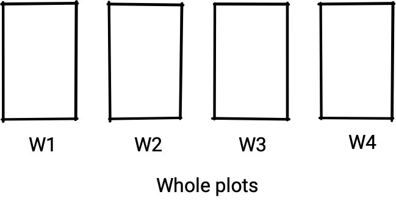
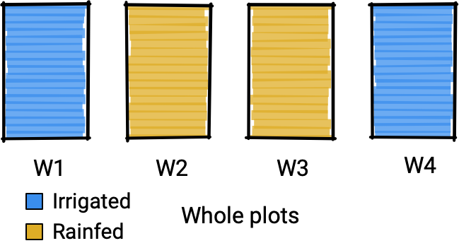
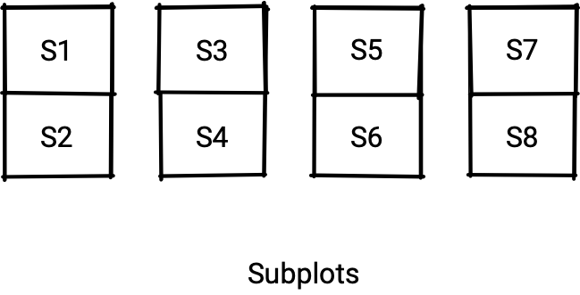
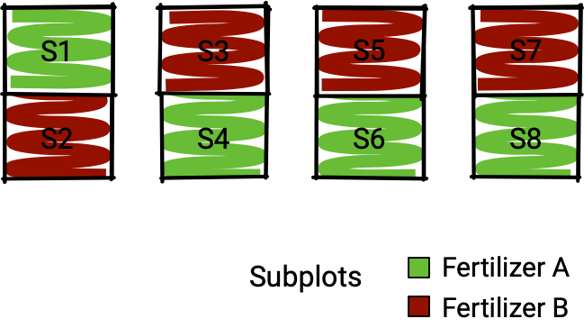
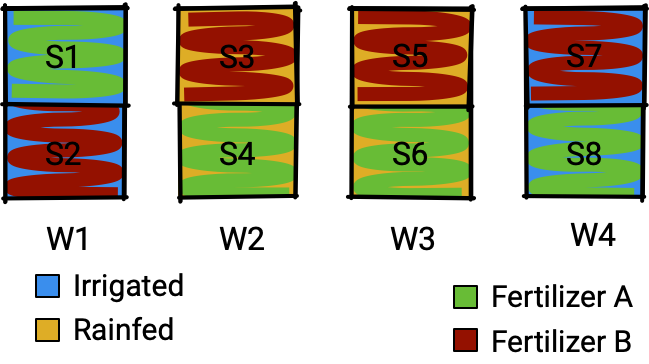
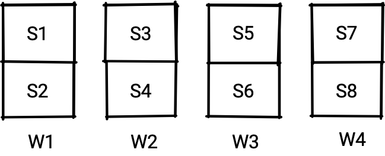
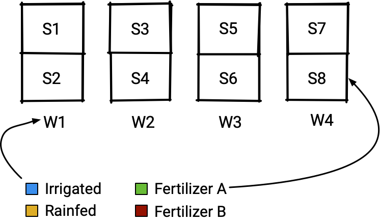
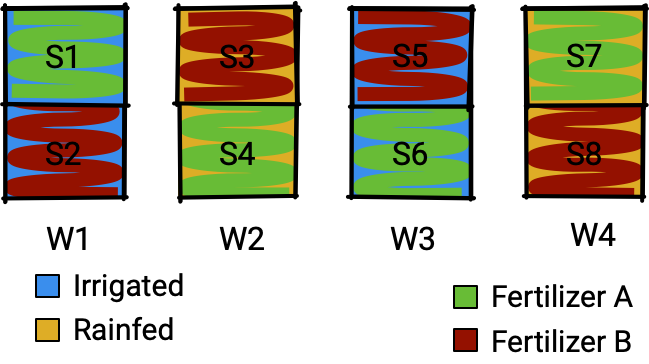

```{r, include = FALSE}
printdf <- function(x) kableExtra::kable_classic(knitr::kable(x))
current_file <- knitr::current_input()
basename <- gsub(".Rmd$", "", current_file)
options(tibble.width = Inf,
        tibble.print_max = Inf)
knitr::opts_chunk$set(
  fig.path = "images/",
  fig.width = 6,
  fig.height = 4,
  fig.align = "center",
  fig.retina = 3,
  echo = TRUE,
  warning = FALSE,
  dev.args = list(bg = "transparent"),
  message = FALSE,
  #cache = TRUE,
  #cache.path = "cache/",
  NULL
)
```

```{r, include = FALSE}
asciicast::init_knitr_engine(
  startup = quote({
      library(edibble)
      options(tibble.width = Inf,
        tibble.print_max = Inf)
    }),
  echo = FALSE,
  echo_input = FALSE,
  options =    list(asciicast_knitr_svg = TRUE, asciicast_at = "end", asciicast_typing_speed = 0, 
        asciicast_padding = 20, asciicast_window = FALSE, asciicast_omit_last_line = FALSE, 
        asciicast_cursor = FALSE, width = 400, asciicast_rows = "auto", 
        asciicast_cols = 100, asciicast_end_wait = 0, crayon.enabled = TRUE, 
        crayon.colors = 256,
        tibble.width = Inf,
        tibble.print_max = Inf)
  )
```


exclude: true
class: middle center hide-slide-number monash-bg-gray80


```{r, include = FALSE}
basename <- ifelse(exists("basename"), basename, "slide")
pdflink <- ifelse(is.null(rmarkdown::metadata$pdflink),
                  paste0(basename, ".pdf"),
                  rmarkdown::metadata$pdflink)
```


.info-box.w-50.bg-white[
These slides are viewed best by Chrome or Firefox and occasionally need to be refreshed if elements did not load properly. Please note this web version takes a while to load. See <a href="`r pdflink`">here for the PDF <i class="fas fa-file-pdf"></i></a>. 
]

<br>

.white[Press the **right arrow** to progress to the next slide!]


---


background-size: cover
class: title-slide
count: false

# .monash-blue[`r rmarkdown::metadata$title`]

<br>

<h2 style="font-weight:900!important;">`r rmarkdown::metadata$subtitle`</h2>

.bottom_abs.width100[

Presenter: *`r rmarkdown::metadata$author`*

<i class="fas fa-university"></i> `r rmarkdown::metadata$department`, <Br>&nbsp;&nbsp;&nbsp;&nbsp;&nbsp;Monash University, Melbourne, Australia

<i class="fas fa-envelope"></i>  `r rmarkdown::metadata$email`

<a href="https://twitter.com/statsgen" style="color:black"><i class="fab fa-twitter"></i> @statsgen</a>

<i class="fas fa-calendar-alt"></i> `r rmarkdown::metadata$date`

<br>

]

???

Hi there, I'm Emi Tanaka and I'm going to be talking to you about the Grammar of Experimental Design.


---

background-image: url("images/OLD_PAPER_TEXTURE.jpg")
background-size: 100%
count: false


# Classical split-plot design

**Context**: Study of 2 irrigation methods and 2 fertilizer brands on the yields of a crop. 

<br>
<center>

</center>


.footnote[
<a href='https://www.freepik.com/free-photos-vectors/background'>Background vector created by boggus - www.freepik.com</a>

]

???

To begin with let's have a look at this classical split-plot design. 
The context of this experiment is that it's a study on the yields of a crop with two irrigation methods, either irrigated or rain-fed, and two fertilizer brands. 

So in order to conduct this study, the experimental resources that is available to us is this land where there are four fields, which I'm going to referring to these as the wholeplot. 

---

background-image: url("images/OLD_PAPER_TEXTURE.jpg")
background-size: 100%
count: false

# Classical split-plot design

**Context**: Study of two irrigation methods and two fertilizer brands on yield of a crop. 

<br>
<center>

</center>


.footnote[
<a href='https://www.freepik.com/free-photos-vectors/background'>Background vector created by boggus - www.freepik.com</a>

]

???

Now for the irrigation method, we have a restriction such that only one irrigation method can be applied per wholeplot. So what you see here, where we got the irrigated wholeplots on the edges and the rainfed wholeplots in the middle, is just one possible randomisation of the irrigation method on the whole plots. 

---

background-image: url("images/OLD_PAPER_TEXTURE.jpg")
background-size: 100%

# Classical split-plot design

**Context**: Study of two irrigation methods and two fertilizer brands on yield of a crop. 

<br>
<center>

</center>


.footnote[
<a href='https://www.freepik.com/free-photos-vectors/background'>Background vector created by boggus - www.freepik.com</a>

]

???

Then what we do next is to split the wholeplot into two subplots, which means that we have 8 subplots in total.

---

background-image: url("images/OLD_PAPER_TEXTURE.jpg")
background-size: 100%

# Classical split-plot design

**Context**: Study of two irrigation methods and two fertilizer brands on yield of a crop. 

<br>
<center>

</center>


.footnote[
<a href='https://www.freepik.com/free-photos-vectors/background'>Background vector created by boggus - www.freepik.com</a>

]

???

Now the fertilizer can be applied to each subplots independently. We don't want to confound the fertilizer brands to the wholeplot, so for each wholeplot, we randomly apply one fertilizer brand to one subplot and the the remaining subplot receives the other fertilizer brand. What you see here is one possible restricted randomisation of fertilizer onto subplot.

---

background-image: url("images/OLD_PAPER_TEXTURE.jpg")
background-size: 100%

# Classical split-plot design

**Context**: Study of two irrigation methods and two fertilizer brands on yield of a crop. 

<br>
<center>

</center>


.footnote[
<a href='https://www.freepik.com/free-photos-vectors/background'>Background vector created by boggus - www.freepik.com</a>

]

???

Putting together the two randomisation results, here we have our classical split plot design. 


---
# How to .monash-blue[code] design of experiments?


.flex[
.w-80.br[
From the grounds up:
```{r, eval = FALSE}
set.seed(1)

# wholeplot
water <- c("irrigated", "rainfed")
data.frame(
  wholeplot = c("W1", "W2", "W3", "W4"),
  water = sample(rep(water, 2))
)

# subplot
brand <- c("A", "B")
data.frame(
  subplot = paste0("S", 1:8),
  fert = as.vector(replicate(4, sample(brand)))
)
```


]
.w-30[
```{r, echo = FALSE}
set.seed(1)
# wholeplot
water <- c("irrigated", "rainfed")
df1 <- data.frame(
  wholeplot = c("W1", "W2", "W3", "W4"),
  water = sample(rep(water, 2))
)

# subplot
brand <- c("A", "B")
df2 <- data.frame(
  subplot = paste0("S", 1:8),
  fert = as.vector(replicate(4, sample(brand)))
)
knitr::kables(list(
  kableExtra::kable_classic(knitr::kable(df1), full_width = FALSE),
  kableExtra::kable_classic(knitr::kable(df2), full_width = FALSE)
))

```

]

]

???

Okay let's get to some R code. We can generate the split plot design from the grounds up just using the base R functions. Here I'm randomising the irrigation method to the wholeplot first, then I randomise the fertilizer brand to subplot. All the result are wrapped up in a data frame format so you can see the output as a table on the right. 


---

background-image: url("images/ivan-jevtic-B5EJm5V5gJs-unsplash.jpg")
background-size: 100%

# The .monash-blue[cool kid] on the block: `agricolae`


```{r, eval = FALSE}
library(agricolae)
design.split(trt1 = water, 
             trt2 = brand,
             r = 2)$book
```
```{r, echo = FALSE}
library(agricolae)
df <- design.split(trt1 = water, 
             trt2 = brand,
             r = 2)$book
kableExtra::kable_classic(knitr::kable(df), full_width = FALSE)
```

???

Another way you can generate a split plot design is using the very popular agricolae package.
There's a function called design.split where you parse the first treatment factor that is applied to whole plot and then the second treatment factor to the subplot, and the number of replicates. You can get the design layout with all the randomisation as a table format just like you see here. 

---

layout: true 
background-image: url("images/joanna-kosinska-mjC9apK53a8-unsplash.jpeg")
background-size: 100%

---

# The .monash-blue[new kid] on the block: `edibble`

.flex[
.w-65[
```{r, eval = FALSE}
library(edibble)
start_design("split-plot") #<<
```

]
.w-35[


]

]

???

I've been working on an alternative method implemented as the edibble R package which builds the experimental design progressively by mapping experimental components to an object oriented system. So let me show how it works. First I'm indicating that I'm creating a new experimental design named split plot which creates an intermediate construct of the experimental design.

---


# The .monash-blue[new kid] on the block: `edibble`

.flex[
.w-65[
```{r, eval = FALSE}
library(edibble)
start_design("split-plot") %>% 
  set_units(wholeplot = 4) #<<
```

]
.w-35[

<center>

</center>

]

]

???

Next, in my code I explicit input that there are 4 wholeplots by using the `set_units` function.

---

# The .monash-blue[new kid] on the block: `edibble`

.flex[
.w-65[
```{r, eval = FALSE}
library(edibble)
start_design("split-plot") %>% 
  set_units(wholeplot = 4) %>% 
  set_units(subplot = nested_in(wholeplot, 2)) #<<
```

]
.w-35[

<center>

</center>

]

]

???

Next I split each wholeplot into two subplots and I do this by set_units and nested_in and the code now reads that there is a unit called subplot and it is nested in wholplot with 2 subplots per wholeplot. 

---

# The .monash-blue[new kid] on the block: `edibble`

.flex[
.w-65[
```{r, eval = FALSE}
library(edibble)
start_design("split-plot") %>% 
  set_units(wholeplot = 4, #<<
            subplot = nested_in(wholeplot, 2)) #<<
```

]
.w-35[

<center>

</center>

]

]

???

I don't have to have a separate set_units function, it can all be within one set_units function and this will still be the same result.

---

# The .monash-blue[new kid] on the block: `edibble`

.flex[
.w-65[
```{r, eval = FALSE}
library(edibble)
start_design("split-plot") %>% 
  set_units(wholeplot = 4, 
            subplot = nested_in(wholeplot, 2)) %>% 
  set_trts(water = c("irrigated", "rainfed"), #<<
           fertilizer = c("A", "B"))) #<<
```

]
.w-35[

<center>

</center>

]

]

???

Next I'm defining the treatments, there are two factors which is the irrigation method and fertilizer brand. 

---

# The .monash-blue[new kid] on the block: `edibble`

.flex[
.w-65[
```{r, eval = FALSE}
library(edibble)
start_design("split-plot") %>% 
  set_units(wholeplot = 4, 
            subplot = nested_in(wholeplot, 2)) %>% 
  set_trts(water = c("irrigated", "rainfed"), 
           fertilizer = c("A", "B"))) %>% 
  allocate_trts(water ~ wholeplot, #<<
                fertilizer ~ subplot) #<<
```

]
.w-35[

<center>

</center>

]

]

???

Then I define my intention to allocate which treatments to which units. So you see here water, or the irrigation method, is allocated to wholeplots and fertilizer brands to subplot. 

---

# The .monash-blue[new kid] on the block: `edibble`

.flex[
.w-65[
```{r, eval = FALSE}
library(edibble)
start_design("split-plot") %>% 
  set_units(wholeplot = 4, 
            subplot = nested_in(wholeplot, 2)) %>% 
  set_trts(water = c("irrigated", "rainfed"), 
           fertilizer = c("A", "B"))) %>% 
  allocate_trts(water ~ wholeplot, 
                fertilizer ~ subplot) %>% 
  randomise_trts() #<<
```

]
.w-35[

<center>

</center>

]

]

???

Then we randomise the treatments to the units. The benefit of this approach is that you can mix and match any steps you like if you don't like the original implementation. 

---

# The .monash-blue[new kid] on the block: `edibble`

.flex[
.w-65[
```{r, eval = FALSE}
library(edibble)
start_design("split-plot") %>% 
  set_units(wholeplot = 4,
            subplot = nested_in(wholeplot, 2)) %>% 
  set_trts(water = c("irrigated", "rainfed"),
           fertilizer = c("A", "B")) %>% 
  allocate_trts(water ~ wholeplot,
                fertilizer ~ subplot) %>% 
  randomise_trts() %>% 
  serve_table() #<<
```

]
.w-35[
```{r, echo = FALSE}
library(edibble)
df <- start_design("split-plot") %>% 
  set_units(wholeplot = 4,
            subplot = nested_in(wholeplot, 2)) %>% 
  set_trts(fertilizer = c("A", "B"),
           water = c("irrigated", "rainfed")) %>% 
  allocate_trts(water ~ wholeplot,
                fertilizer ~ subplot) %>% 
  randomise_trts() %>% 
  serve_table()
kableExtra::kable_classic(knitr::kable(df), full_width = FALSE)
```


]

]

???

Now finally you can signal that you're done constructing the design and get the output as a data frame using the serve_table command.

---

class: transition 

<h1 id="shadowBox" class="rainbow rainbow_text_animated">Grammar of <br>Experimental Designs</h1>

.gray.dance[Coming soon to an experiment near you]

https://github.com/emitanaka/edibble

???

That was a quick overview of the edibble R-package which implements what I call the grammar of experimental design. You can find the package and more information on my github account at github.com/emitanaka/edibble.